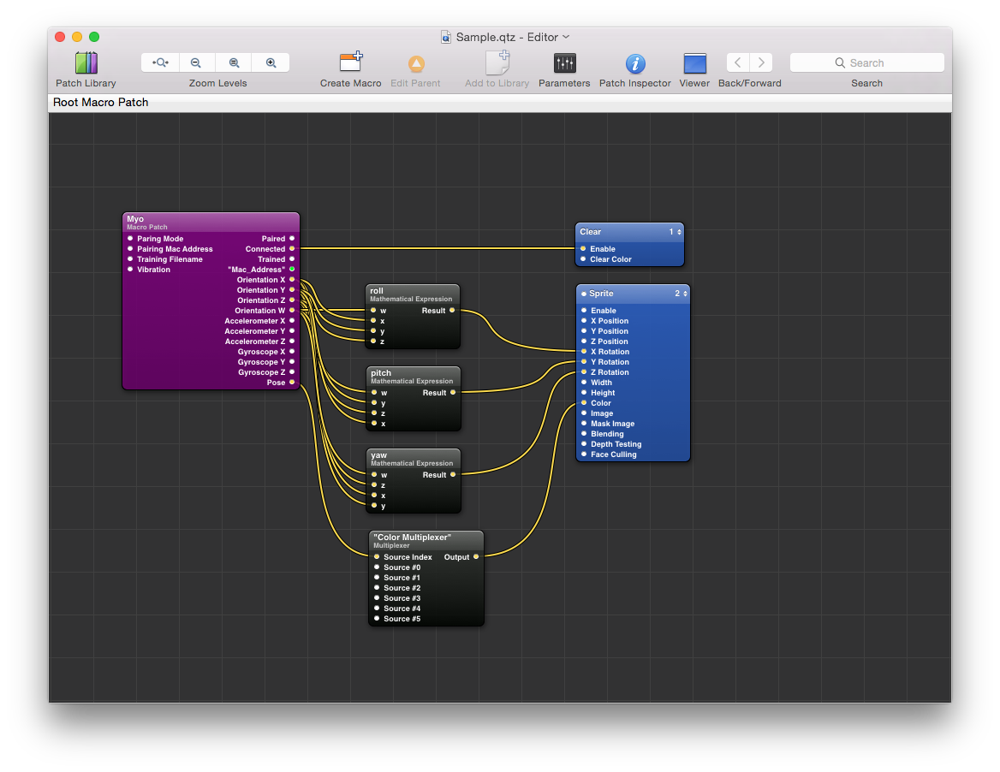

##### Myo Quartz Composer plug-in

Quartz Composer Plug-In with support of the Myo.

Features:
 - Orientation, accelerometer and gyrometer support
 - Pose support
 - Pairing modes
 - Load Training profiles

You can either build the plug-in yourself or unpack [QCMyo.plugin.zip](QCMyo.plugin.zip) and copy the *QCMyo.plugin* to *~/Graphics/Quartz Composer Plug-Ins*.
The [Sample.qtz](Sample.qtz) contains a sample how to use the Myo inside of Quartz Composer.

